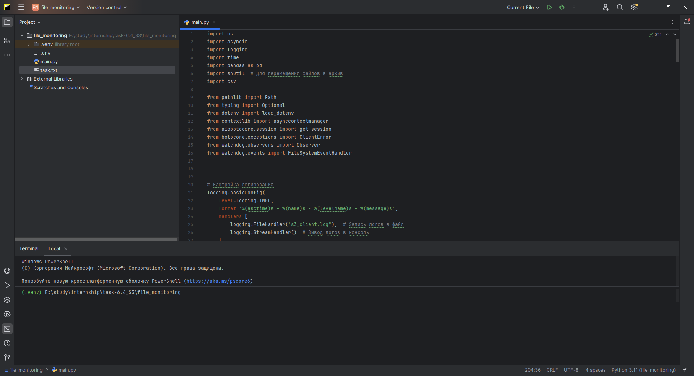
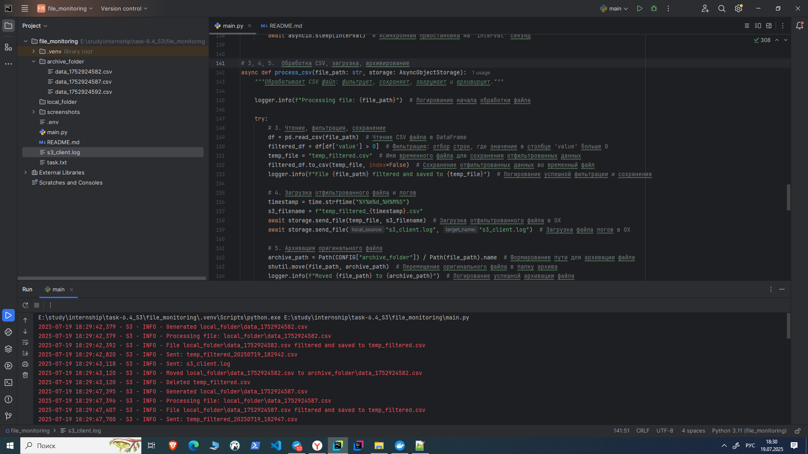
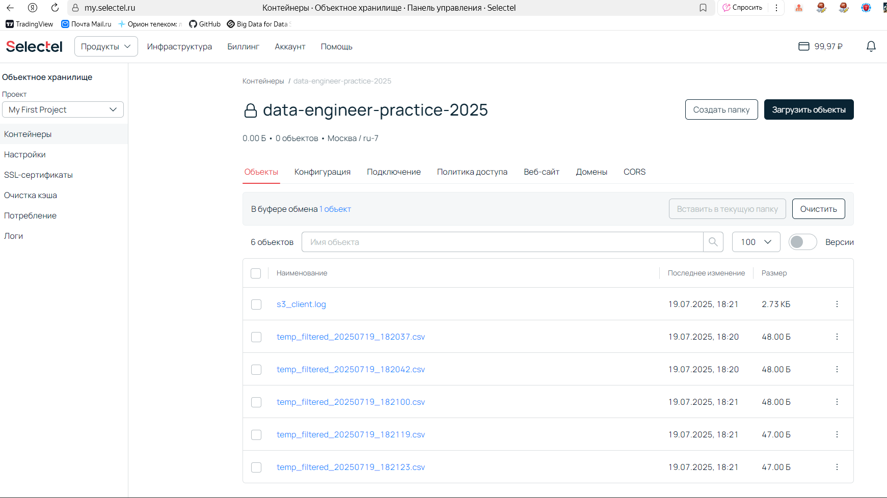

# Автоматизированный пайплайн обработки CSV файлов

## Описание задания

Необходимо создать автоматизированный пайплайн, который выполняет следующие задачи:

1.  **Генерация CSV файлов:**  Каждые 5 секунд генерируется новый CSV файл с данными (timestamp и значение) в указанной локальной папке.
2.  **Мониторинг папки:** Пайплайн отслеживает указанную локальную папку на предмет появления новых CSV файлов.
3.  **Обработка CSV:** При появлении нового CSV файла, пайплайн читает его содержимое в pandas.DataFrame, выполняет фильтрацию данных (оставляет только строки, где значение больше 0), и сохраняет отфильтрованный результат во временный файл.
4.  **Загрузка в хранилище:** Пайплайн асинхронно загружает отфильтрованный CSV файл и файл с логами (s3\_client.log) в указанный бакет объектного хранилища. При этом файл с логами перезаписывается при каждой загрузке.
5.  **Архивация:** После успешной обработки и загрузки, исходный CSV файл перемещается в локальную папку архива.
6.  **Логирование:** Все этапы работы пайплайна логируются в файл `s3_client.log`, который также периодически загружается в объектное хранилище.

## Решение

Решение реализовано в файле `main.py` с использованием следующих библиотек:

*   `asyncio`: Для асинхронного выполнения задач.
*   `logging`: Для логирования работы пайплайна.
*   `time`: Для работы со временем.
*   `pandas`: Для работы с CSV файлами и DataFrames.
*   `shutil`: Для перемещения файлов.
*   `pathlib`: Для работы с путями к файлам и директориям.
*   `dotenv`: Для загрузки переменных окружения из файла `.env`.
*   `aiobotocore`: Для асинхронного взаимодействия с объектным хранилищем (S3-совместимым).
*   `watchdog`: Для отслеживания изменений в файловой системе.
*   `csv`: Для генерации CSV файлов.

### Работа пайплайна

1.  **Настройка:**
    *   Загружаются переменные окружения из файла `.env` (необходимо указать свои параметры доступа к объектному хранилищу: `KEY_ID`, `SECRET`, `ENDPOINT`, `CONTAINER`).

2.  **До запуска `main.py`:**
    *   В папке проекта находятся следующие файлы: `.env`, `main.py`, `task.txt` (содержит описание задания).
    *   Папки `local_folder` и `archive_folder` отсутствуют (будут созданы скриптом).
    *   В объектном хранилище находится бакет, указанный в `.env`. Он может быть пустым или содержать другие файлы.

3.  **После запуска `main.py`:**
    *   **Генерация CSV файлов:** Начинается генерация CSV файлов в папке `local_folder` с интервалом в 5 секунд.
    *   **Мониторинг папки:** Запускается `watchdog`, который отслеживает папку `local_folder`.

Когда в папке `local_folder` появляется новый CSV файл, происходит следующее:

1. **Обработка CSV файла:**
    *   Файл читается с использованием `pandas.read_csv`.
    *   Выполняется фильтрация: остаются только строки, где столбец `value` > 0.
    *   Отфильтрованные данные сохраняются во временный файл `temp_filtered.csv`.
2.  **Загрузка в хранилище:**
    *   Файл `temp_filtered.csv` асинхронно загружается в бакет объектного хранилища под именем `[имя_оригинального_файла]_filtered.csv`.
    *   Файл логов `s3_client.log` асинхронно загружается в бакет объектного хранилища под именем `s3_client.log`.  При каждой загрузке он перезаписывается.
3.  **Архивирование:**
    *   Оригинальный CSV файл перемещается из папки `local_folder` в папку `archive_folder`.
    *   Временный файл `temp_filtered.csv` удаляется.
4.  **Логирование:**  Все действия логируются в файл `s3_client.log`.

   *   **Структура после обработки одного файла:**

       *   **Локально:**
           *   Папка [local_folder](file_monitoring/local_folder):  Содержит сгенерированные CSV файлы (если они успели появиться за время обработки предыдущего).
           *   Папка [archive_folder](file_monitoring/archive_folder): Содержит перемещенный оригинальный CSV файл.
           *   Файл [.env](file_monitoring/.env): Содержит логи работы пайплайна.
           *   Файл [main.py](file_monitoring/main.py):
           *   Файл [s3_client.log](file_monitoring/s3_client.log): Содержит логи работы пайплайна.
       *   **В объектном хранилище:**
           *   Содержит `temp_filtered_20250719_182942.csv` (отфильтрованные CSV файлы).
           *   Содержит `s3_client.log` (файл логов).
           

## Зависимости

Перед запуском необходимо установить зависимости:
